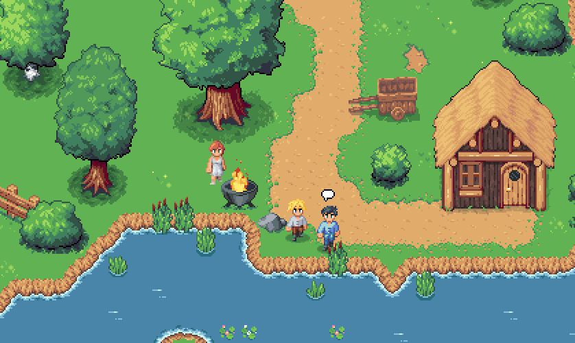
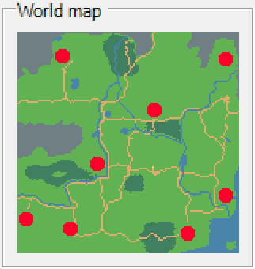
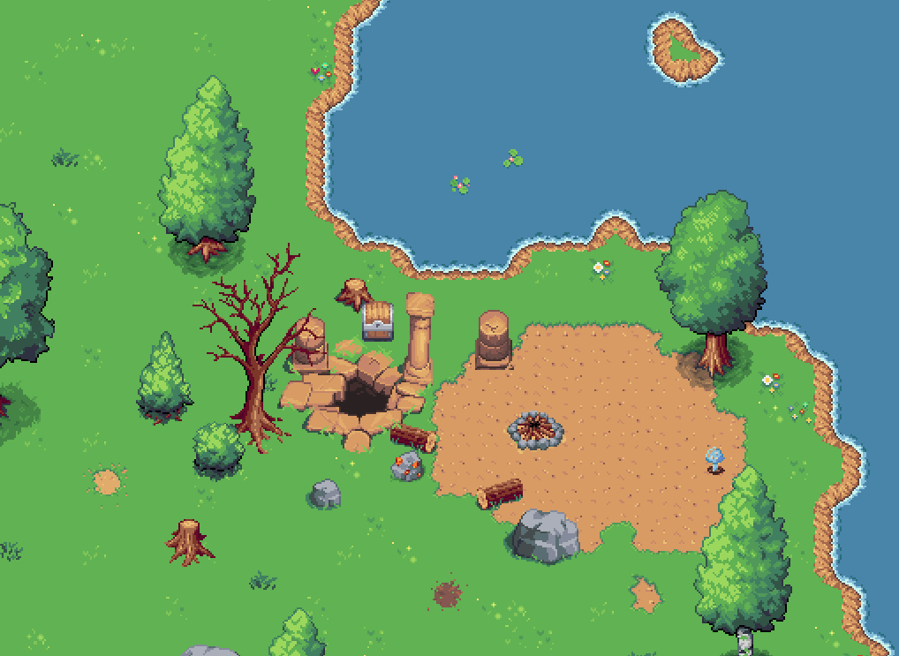

## Why Our Game Is More Than Just Empty Space

There's a common pitfall in the world of open-world games: vast maps with nothing meaningful to do. We've all experienced it—a beautiful environment stretched across miles of digital space, but without purpose. The scenery is impressive, but the heart of the game feels… hollow.

When we designed our world we wanted to prevent that pitfall from the beginning. We want every level to matter. Not just in size, but in spirit. Not just in visuals, but in depth. Every location, every character, every quest, all crafted with care to give players a reason to explore, engage, and ultimately, to belong.

This blog post is about that philosophy. About what it means to build a world that isn't just big, but **alive**.

## A World Full of People, Not Just Landmarks

Our world isn't just a stage for our gameplay. It's a living, breathing home for its inhabitants. Cities hum with activity, from merchants shouting deals in crowded marketplaces to children chasing each other through alleys. In quiet villages, farmers wake before dawn, and innkeepers swap gossip as adventurers pass through.

NPCs aren't background noise. They have lives, relationships, fears, and hopes. Some will remember your choices and talk about it, celebrate you. Others will ask for help and return the favour in unexpected ways. Many will go about their routines, day and night, whether you're watching or not.

We believe that **people make places memorable.** It's not just about the walls of a castle, it's about the guard who's been stationed there too long, the cook who dreams of leaving, the ghost of a queen who lingers in silence.

## A World with Purpose

Wandering aimlessly can be peaceful. But in our game, there's always a sense of direction beneath the freedom. This isn't just a sandbox for the sake of scale. There's a **purpose** to everything: to the places, to the problems, and to your presence within them.

The world is under threat, and your actions matter. Whether you're clearing a cursed forest, rebuilding a broken town, or uncovering ancient truths in forgotten ruins, everything you do changes the world. And not in a subtle way, new paths will open, peoples lives will change forever.

You're not just passing through this world, but you're helping shape it. That gives exploration real weight.

## Exploration That Sparks Curiosity

We want you to want to **look behind the waterfall** and not because a checklist told you to, but because you _feel_ like there's something there (a mandatory treasure chest, right?). Our world is designed to reward curiosity.

You might discover a hidden cave with its own miniature story inside. A forgotten grave tucked into a quiet forest. A ruin that hints at a long-lost culture. We build exploration around moments of _wonder_, not tasks.

Instead of a map filled with glowing icons and fast travel points, we want you to take the long road. To let the world unfold naturally. To stumble upon something meaningful, not just efficient. Sure we have a fast travel system, but we try to seduce you to hike from city to city, stumbling upon adventure along the way.

## Telling Stories Through Level Design

Storytelling doesn't stop at dialogue or cutscenes. Our **level design tells stories**, too.

A broken bridge might hint at a battle that happened years ago. A city's layout may reflect how it grew from a small riverside village. A dungeon carved into a cliff side could hold clues about the culture that once called it home.

Every stone, every piece of furniture, every bit of environmental storytelling is placed with intent. We don't generate content, we designed it. We want you to walk into a room and _feel_ what happened there before reading a single word.

Good level design doesn't just guide the player, but it should inspires questions. Who built this? What happened here? Why is this here, and not somewhere else?

## Cities That Feel Alive

In many games, cities are little more than oversized quest hubs. In ours, they are **living ecosystems.**

Each city has a unique culture, architecture, and rhythm. Some are bustling centers of trade, with layered social classes and political tension. Others are quiet, isolated, shaped by the climate and terrain. You'll find guilds, libraries, criminal underbellies, sacred temples, and forgotten corners tucked between rooftops.

Importantly, cities change. Help their citizens, and you might witness festivals, reconstruction, or the return of long-lost traditions. Ignore them, and you might find them in decline or occupied by darker forces.

We want cities to feel like **characters** themselves: complex, evolving, and rich with detail.

## Dungeons With Stories to Tell

Dungeons in our world aren't just obstacle courses, but they're **chapters of the narrative**.

Every dungeon is designed with its own identity. One might be the crumbling ruin of a once-proud fortress, haunted by its past. Another might be an underground sanctuary twisted by long forbidden rituals. They're not just different in layout and enemy types, but they're different in _meaning_.

Exploring a dungeon is as much about uncovering its story as it is about surviving it. Lore is built into the walls, into the traps, into the boss battles. You'll come out of each one not just with loot, but with **knowledge** about the world, its history, and your place in it.

## Secrets to Reward the Observant

Not everything is on the surface.

There are secrets (clever ones, hidden ones, meaningful ones) tucked throughout the world. Some are puzzles that demand attention. Others are tied to characters you'll meet, requiring choices or timing to unlock. Some are just for fun. Many are optional, but all are placed with purpose.

We don't want to tell you everything. We want you to **discover it.** And when you do, it should feel like a reward not just for your skill, but for your curiosity.

We had so much fun putting in all kinds of little secrets, many might not even be discovered by the player, but we know they are there and all together they will give the player a feeling of a living world.

## Helping People Who Matter

Helping people in this world isn't about ticking off quests, it's about **making an impact**.

Many NPCs have ongoing lives and stories. When you help them, things change. They remember you and your actions. They might even show up later in your journey, stronger or changed because of your influence. When you "forget" to put clothes on NPC's **will** notice and comment you about it.

We want players to **care about the people they meet**. Not just because they give rewards, but because they feel real. Their joys, their pain, their struggles, it all plays into the emotional tapestry of the game.

When someone asks for your help, it's not just content, it's a connection.

## A World Worth Saving

At the heart of the story is a world in need. Not just of a hero, but of **hope**.

There's darkness spreading. Not in the "generic evil" sense, but in the slow erosion of what once was beautiful. And you, the player, is one of the few who can turn the tide.

Saving the world means more than defeating a final boss. It means **rekindling belief**, **restoring what was lost**, **mending what's broken**. That's a tall order, but it's also what makes the journey meaningful.

You're not a bystander. You're a force for change.

## Make a Difference and See It

One of the most important parts of this world is that it **responds to you**.

Help build a bridge, and you'll see its neighbouring town thrive over time. Support a struggling leader, and you'll feel the ripple effects of your choice in cities far away. Solve a mystery, and unlock a story no one else might ever find.

We want you to **see the results** of your actions. Not just in dialogue, but in architecture, culture, environment, and emotion.

This is a world that remembers. And it's a world that changes, **because of you.**

## More Than Just a Map

So yes, our game has a large world. But more importantly, it has **a meaningful one**.

It's filled with life, with purpose, with stories. It's not just there to be crossed, it's there to be felt. To be lived in. To be shaped.

We're building this world not just for you to play, but for you to care.

And in return, we hope it's a world you'll never want to leave ever again.

Thanks for sticking with us. We can't wait to show you more in future blogposts. And remember, if you have any questions, remarks or comments feel free to leave us a note.
