This blog post describes the physical construction phase of an arcade cabinet project. The author explains the materials, cutting, and assembly process completed by May 17th.

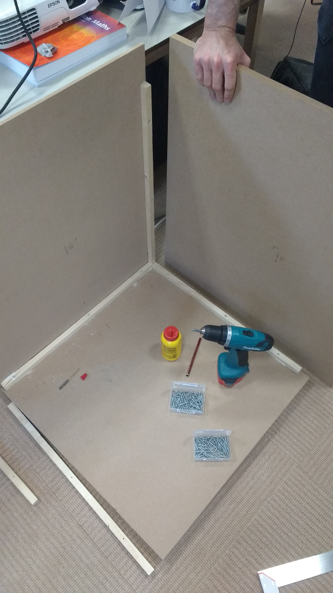

## Materials Used

The team selected **MDF which is easy to saw, and cheap to buy** in various thicknesses:
- **18mm** for structural parts
- **9mm** for panels
- **4mm** for the control panel

Additional materials included:
- Pinewood beams internally
- Wood glue and screws for assembly
- Acrylic sheets for protective covering
- T-molding for edge finishing

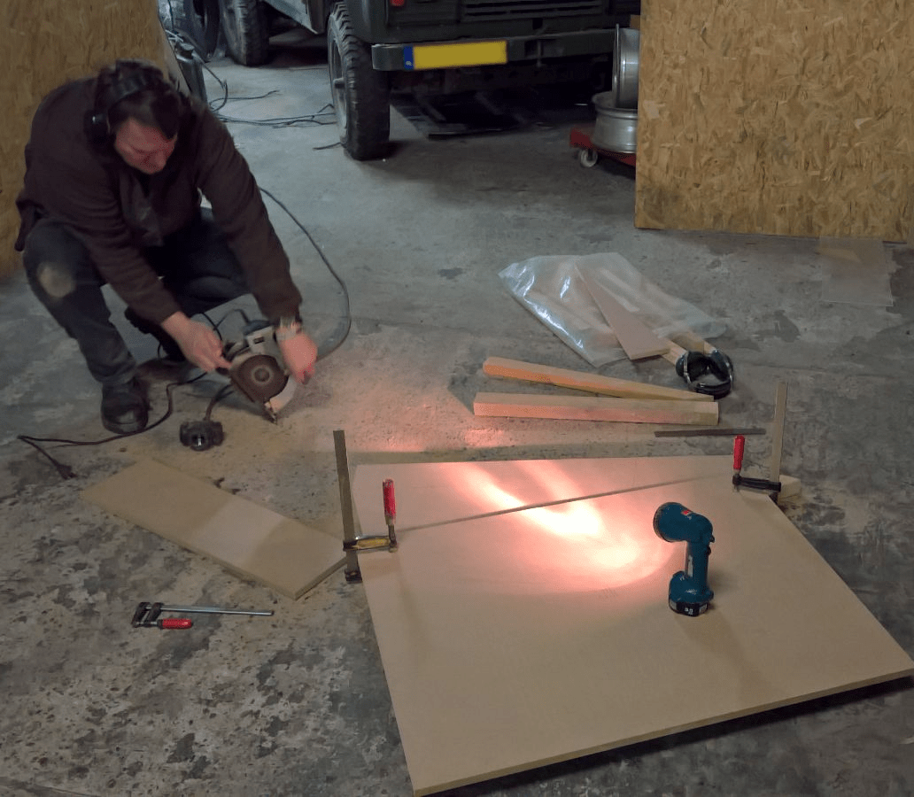

## Construction Challenges

The most significant difficulty involved working with acrylic:

**"Drilling and cutting acrylic sheets isn't that easy. If you go a little too fast the sheet shatters."**

The team used a milling cutter for grooves and ventilation details. This required patience and precision—rush it and you destroy expensive materials.

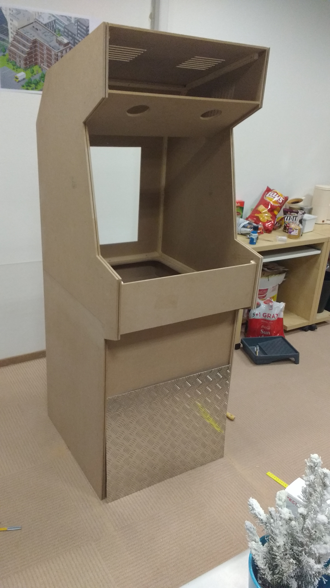

## Assembly Process

Assembly proceeded smoothly with no measurement errors. The cabinet was designed with a detachable top section for transport, making it practical for events and demonstrations.

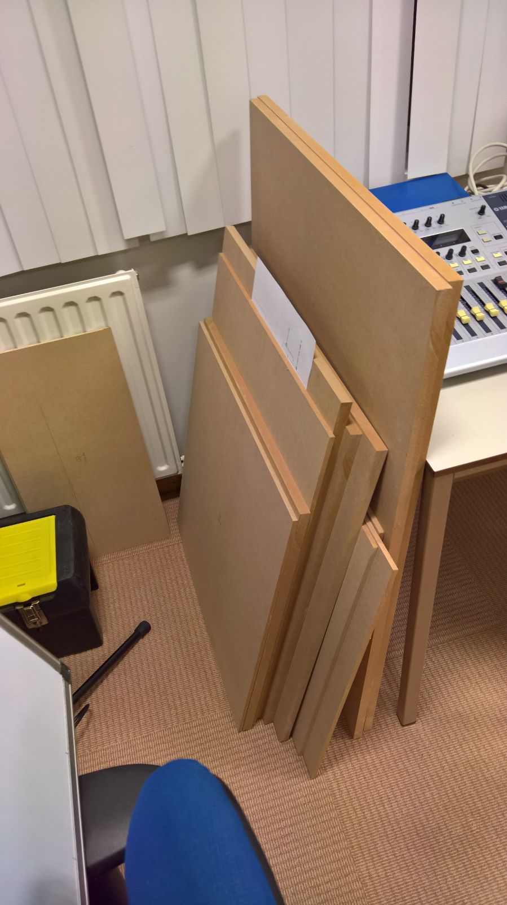

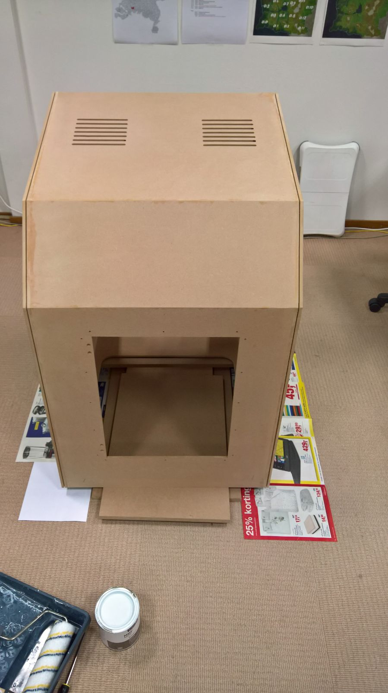

### Key Assembly Steps

1. **Cut all pieces** according to precise measurements
2. **Dry fit** everything before gluing
3. **Internal bracing** with pinewood beams
4. **Glue and screw** structural elements
5. **Add T-molding** to side panels for aesthetic finishing
6. **Install acrylic** protective covers

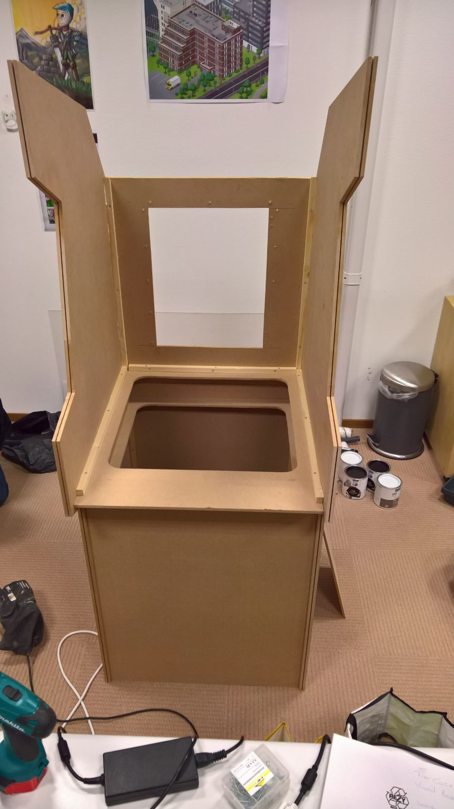

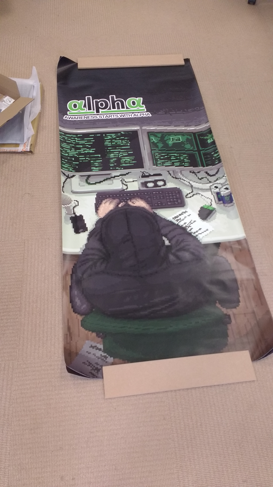

## Design Decisions

### Detachable Top

The cabinet features a **detachable top section** for easy transport. This was crucial for a team that wanted to bring their arcade cabinet to events and showcases.

### Material Choices

MDF proved ideal for:
- Easy cutting and shaping
- Affordable price point
- Smooth finish for painting
- Structural rigidity

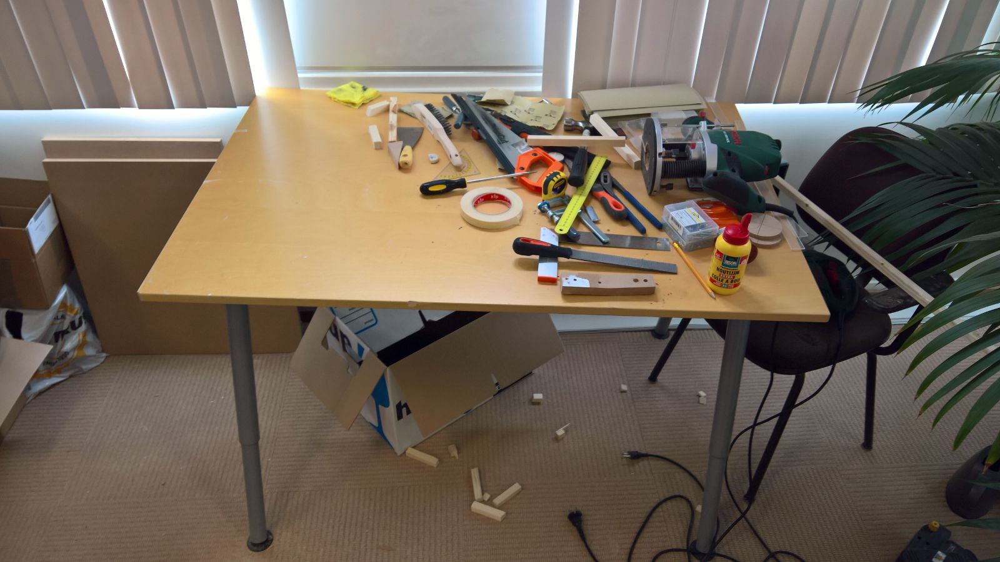

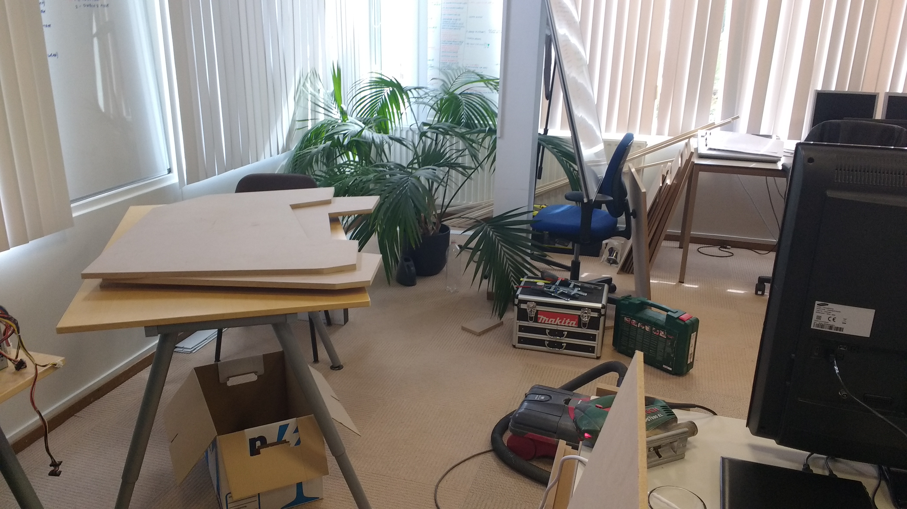

## Lessons Learned

1. **Acrylic is unforgiving** - Work slowly and carefully
2. **Dry fit everything** - Measure twice, cut once isn't just a saying
3. **Plan for transport** - Detachable sections save headaches later
4. **Use the right tools** - A milling cutter makes cleaner cuts than improvising

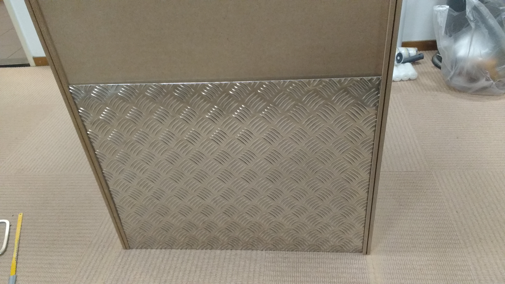

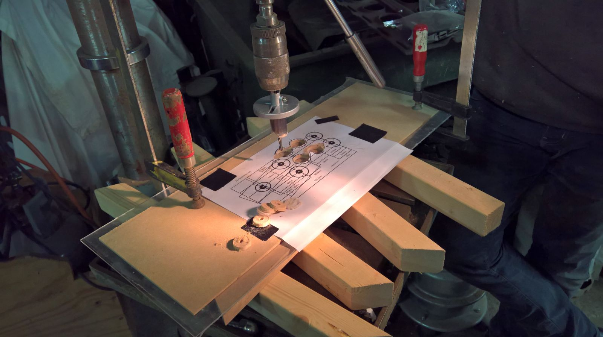

## The Result

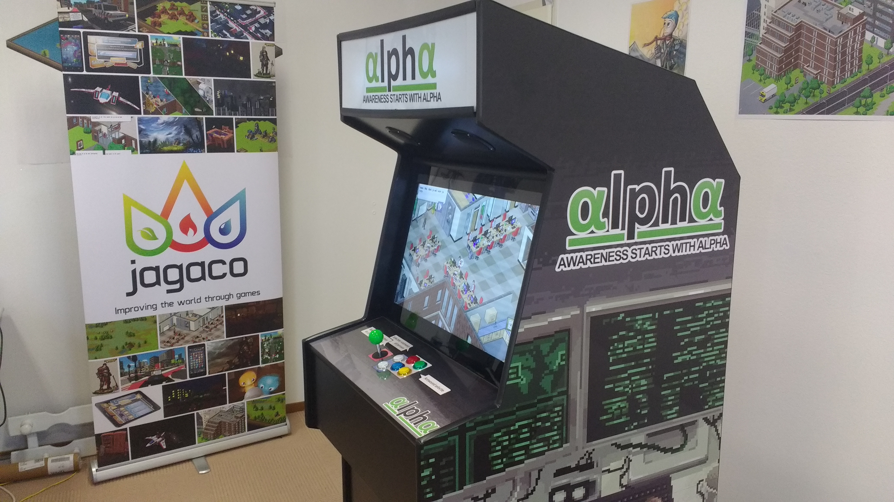

By May 17th, the physical construction was complete. The cabinet stood proud—a testament to careful planning, precision cutting, and patient assembly.

## What's Next?

With the physical cabinet complete, the next phases include:
- Electronics installation
- Monitor mounting
- Control panel wiring
- Software configuration
- Art and branding

Building an arcade cabinet is a journey of passion and precision. Every cut, every joint, every detail matters. But when it's done, you have something truly special—a physical manifestation of gaming history that you built with your own hands.
