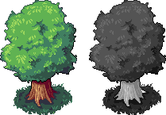

# Crafting Beauty Through Limitations

Jagaco Games employs **indexed rendering** in their upcoming title—a technique that enforces a strict visual palette of 82 colors throughout all game assets, from characters to UI elements.

## What is Indexed Rendering?

Indexed rendering differs from traditional 3D rendering index buffers. Instead, it controls how colors are processed during final screen rendering. The studio commits to pixel art principles by maintaining a carefully curated 82-color palette applied universally across the game.

## The Creative Rationale

The team drew inspiration from *Wargroove* and adopted design philosophy from industry figures:

> "The enemy of art is the absence of limitations."

> "Limitation makes the creative mind inventive."

This constraint-based approach prevents accidental color violations. The asset pipeline automatically converts artwork into indexed color format, flagging out-of-bounds colors with bright red warnings. Artists' original work undergoes processing where each pixel matches the nearest palette color, producing grayscale indexed images that reference the palette through post-processing shaders.

## Key Advantages

- **Consistency**: All visuals adhere to identical artistic rules
- **Efficiency**: Single palette changes update every dependent asset instantly
- **Control**: Reinforces artistic discipline and visual integrity

## Philosophy

The studio emphasizes intentional design choices. Rather than asking "Can we?", developers ask **"Should we?"**

This deliberate restraint mirrors how poets select words and composers choose notes—finding expression through thoughtful limitation rather than abundance.

## The Beauty of Constraints

Working within a fixed palette forces creative solutions that might never emerge in an environment of unlimited choice. Every color becomes meaningful. Every pixel matters. The result is a cohesive visual identity that players immediately recognize.

Constraints don't limit creativity—they define it.
