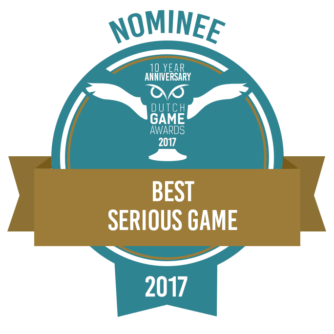

Jagaco received a nomination for the Dutch Game Awards in the **"Best Serious Game"** category. The company expressed enthusiasm about this recognition of their work over the preceding years.

## The Project: Blokje Om

The nominated game, **Blokje Om**, was developed through collaboration between:
- Jagaco
- Sophia Rehabilitation's Smart Lab
- The Hague University

More than 25 students contributed to extensive research and prototype development.

## Project Background

Therapists at Sophia Rehabilitation conceived the game to address training limitations. Previously, "children would go out onto the street with therapists to practice things like crossing the roads," which created impractical and potentially dangerous situations.

**Blokje Om provides safe virtual scenarios where children can train while therapists monitor progress.**

### The Problem

Traditional traffic safety training for children with disabilities presented several challenges:
- Safety concerns with real-world training
- Limited scenarios available
- Difficulty tracking progress
- Weather and scheduling constraints

### The Solution

Blokje Om uses VR technology to create:
- Safe, repeatable training scenarios
- Controlled environments for learning
- Measurable progress tracking
- Engaging gameplay that motivates practice

## Development Effort

Over **18 months**, students researched topics including:
- Motion sickness in VR
- Traffic safety monitoring
- Accessibility considerations
- Child-friendly VR interaction design

Additional student teams:
- Built software prototypes
- Developed specialized hardware controls
- Created engaging gameplay elements
- Tested with children and therapists

## The Partnership

The triangular partnership between **business, healthcare, and education** strengthened the final product's effectiveness for both children and therapists.

### Why This Partnership Worked

- **Jagaco** provided technical expertise and game design knowledge
- **Sophia Rehabilitation** contributed medical and therapeutic insights
- **The Hague University** supplied research and development resources

Together, they created something none could have built alone.

## Impact

Blokje Om demonstrates how games can serve purposes beyond entertainment. By combining therapeutic needs with engaging gameplay and cutting-edge VR technology, the project helps children develop critical life skills in a safe, fun environment.

## Recognition

The Dutch Game Awards nomination validated years of collaboration and dedication. While "Best Serious Game" might sound less glamorous than other categories, it represents games that genuinely improve lives.

That's something worth celebrating.
