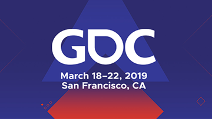

28.000 people taking over San Francisco for a week. Bringing money to the local economy and going away with much more knowledge and friends than which you came with. This year the Game Developers Conference features over 750 sessions divided into more than 12 tracks.

I will update all the days with photo's as soon as I have a decent internet connection. The connection at my hotel is from the 1980's…

---

## Day 0

I'm back again, after four years! Walking around San Francisco and knowing/remembering/recognizing all the streets is a great feeling. I'm here with three colleagues and for one of them it's his first time here. So we did all the mandatory tourist stuff like riding the cable cars, seeing pier 39 and making pictures of Alcatraz and the golden gate bridge. The fudge shop is still on Pier 39, so I bought 1,5 kilograms (three pounds in retard) of it in different flavours. I was planning on bringing some of it home, but it will not survive for two more days at this pace. We pre-registered at the GDC and walked around the centre a little. For all three colleagues it's their first time at the GDC, so as a four-time veteran I can show them around a little. I'm happy to see that Moscone West is also used, so this will be a big one. And the amount of presentations confirms that thought.

Our hotel is nice(ish) but clean! And the cleanliness is the most important thing for me. For having only three stars the rooms are quite big. The location of it isn't the best and we need to manoeuvre between the homeless people on our way to the Moscone Center.
Due to horrible internet in the hotel my updates will be late!

---

## Day 1

The days at the GDC start at a sane time, 10 o'clock in the morning. There are 28.000 game programmers and a majority of them are technical oriented and they are used to starting later in the morning and I must say that I like it!

We are also playing the rainbow hair colour bingo. In this game you must spot a person with a hair colour in one of the shades of the rainbow which haven't been seen before by someone else. The funny thing is that after only a couple of hours we already had seen all the colours of the rainbow!

My first presentation was about "Efficient Rendering in The Division 2" given by Ubisoft Massive & AMD and it was a nice technical start of the event. I tried to keep my sessions diverse today, I also went to a post-mortem of "Kingdoms and Castles" and to an Educational Summit about teaching game development. And one of the talks was about the importance of your tooling. "If your editor is broken, then your game is broken!" We often forget the importance of the tooling, making it harder for the artists to iterate and/or test new assets in the game. On the first day of the conference I already have a nice take-away.

Tomorrow Google is revealing "everything" at 10 o'clock, that must be about their new game/streaming console. My colleagues are hyped about it, but I don't think much of Google, so we'll see.

---

## Day 2

The Google keynote started at 10:00. We wanted to be early, because it would be popular and there would be a line. At 09:30 the line was already far outside of the Moscone centre. My colleagues brutally cut the line (and all I could do was follow them and judge them silently). But even with cutting over half of the line eventually we couldn't make it inside. There were only 500 general admission seats available.

The big reveal was Google Stadia, but the only thing they had to show was a controller. The controller wasn't spectacular (just a copy of the Xbox controller) and the Google "console" will be their try on a streaming service (also done before). I found it all very underwhelming.

I went to several level design workshops. One was of God of War and another was about rewarding exploration and a third about designing radical non-linear levels. It was a nice sidestep from the technical programming sessions I normally go to and they gave me many new insights in the decisions you need to make while designing levels for your games.

I also went to a session about "Bringing Fortnite to mobile using Vulkan". This session felt so wrong in so many ways. But it was actually a nice insight view of the hurdles they had to take to be able to run Fortnite on mobile devices and upgrading the possibilities of the Unreal Engine along the way. All the improvements they made count for the entire Unreal Engine, they didn't "hack" stuff in just for Fortnite.

---

## Day 3

The first day of the main conference, and it shows in huge increase of people here. I started my day at 09:00 with a session about the making of Divinity Original Sins 2 by Larian Studios presented by Swen Vincke himself. It was cool to finally see him in real life and the talk was very nice. I could find many parallels with Jagaco (also in the mistakes they made).

After that one I went to "Down the rabbit hole with Oculus Quest". It wasn't very nice. The slides had MOVING (jumping between two frames) text on them ALL the time. It was hard to follow. The Oculus Quest is just a GearVR with a mobile phone build in. You cannot run your Rift games on them and you need to do extensive work to port your game to a mobile device to make it run on it. It can handle about 45K tris in a total scene and it runs on 72 FPS. The Rift S on the other hand looks quite nice and will be an upgrade to the 'normal' Rift.

At 12:30 I went to "Graphics reinvented: RTX Update" presented by Nvidia. I can say that I've seen the future. "RTX on" really is a thing of the future and I do believe that the classic rasterizer will seize to exist. Ok, it will not go away completely, but Raytracing will be the next big thing in graphics. The grounding of the objects in the scene are so nice and you don't have to do all kinds of lightning tricks anymore. They showed multiple examples of 4K screenshots of modern games which looked really nice already, but then they showed the same screenshot with the ray tracer enabled and it was so much better. It was inspiring to see.

After all the visual grandeur of Nvidia I went to a session of Microsoft about the new VRS (Variable Rate Shading). And this is the next big step in graphics rendering after MSAA. With VRS you are able to down sample your fragement shading and spread the result of a single fragment-calculation over multiple pixels. For the first time it is possible to colour more pixels then you're executing fragment shader calls. The downgrade in resolution is not at all noticeable and the increase in render speed is significant. They demo'ed Civilisation 6 (which uses a pure forward rendering engine!) and the results were not noticeable (only after zooming in and pointing at the differences). VRS will be a new feature in DirectX12 and will be available today (21/03/2019).

The last session of the day was a classic game postmortum of Lemmings presented by one of the original creators Mike Dailly. It was really nice to see how they build it and which wacky choices they had to make back then.

The Google Stadia stands are desolate, if this is a forecast for the success of their system, then I wish them good luck.

---

## Day 4

Started the day at 10:00 with a classic game postmortem: Command & Conquer (CNC). They started the presentation with the installation sequence of CNC, which brought back fond memories. The games of today have boring and simple installation with maybe a small progressbar. If you don't know the installation sequence of CNC, please look it up on Youtube and be amazed. The music director played on his bass live at the beginning and end of the session. It was also fun to see and hear the voice of E.V.A. She was the receptionist of Westwood at the time and was asked to do the voicing of E.V.A. Late during production they also found out the forgot to recruit an actor for Seth, so the movie director became Seth on the spot. I can also tell you that Kane got old but is still very recognizable.

After this session it was time to investigate the EXPO and score some goodies. In total I have five t-shirts and a stuffed animal of MagicLeap. Hopefully tomorrow I can sign myself up for a session at the MagicLeap stand.

At 14:00 I continued with "Marvel's Spider-man Procedural Lighting Tools". All the Spider-man sessions are super popular and there are always large lines to get in. Luckily I got into this one. It was nice to see how they try to offload some of the lighting work of the artists. They can automatically place light posts at the sides of the streets and the real-time reflection map is placed at strategic places in the grid. Insomniac has their own engine and they heavily modified it for this Spider-man game.

I continued the day with "Automated Testing: Using A.I. Controlled Players to Test The Division" which was a really nice session about automated playtesting. They've created lightweight bots that play the game for them even with all the graphics turned on, so they could also use the tests as benchmarks to find low-FPS hotspots. The bots play all the missions and in a "simple" way try to traverse through all the new content. If the bot gets stuck and times out a repost is generated for humans to inspect the next day. Through these bots they could play the game every night many times to find problems early on. This doesn't replace human playtesting, for example clear render issues are not noticed by these bots, but it does help a lot in reducing the testcases.

Last session was "Marvel's Spider-man: A technical postmortem", 250 slides and 300 words per second, this guys went fast. More presenters do this at the GDC, just to cram in as much information as possible. The funniest part of this presentation was the blooper-reel at the end. All the hilarious things that went wrong were shown. I'm not sure if this session will become publicly available, but if it does have a look! One of the questions from the audience was about the reflective water in the E3 2017 screenshot which didn't make the game (see comparison screenshot below). In-game the water reflection was way less and the conspiracy on the internet was quit to jump to the conclusion that the engine wasn't able to render all those reflections runtime. The presenter said they had to do an internal investigation on why the puddle was changed. Eventually he found out that the demo scene was handmade by an artist and the in-game version had generated puddles. That is the only reason why the images are different.

---

## Day 5

The final day already. Always a shame when you know after today it will be over, but on the other hand I have so many new ideas to try out that I cannot wait to get my hands on it and start programming.

The day started at 09:45 to try to get a demo session of the MagicLeap. But even though we were 15 minutes before the opening there were already so many people in front of us that we didn't make it. So we scored some more t-shirts from Unreal and went to the first session of the day about "Startship physics and controls that feel real: Bringing the toys of Starlink to digital life". It was short but interesting session about the physics involved in the steering of the starship. When you play the game, you don't even notice how much work went into that natural feeling.

Next stop was "Designing Path of Exile to be played forever" by Chris Wilson. He told us beforehand he had a lot of ground to cover so he would talk fast. And he didn't lie. I think he didn't breathe in for the whole 45 minutes. The 90 slides went by in lightning speed and you didn't have time to blink, because you would miss half of it. But I like this kind of sessions, the information density is extremely high, and I come here to learn, so it's ok. It's nice to see so many parallels with Jagaco. They started small (a team of 18 people), are also self-funding, created their own engine and tooling and were struggling in the beginning. After the session I really felt like playing the game, which I never did before, so I should give it a try.

The last session of the day and of this GDC for me was "Scalable Real-time global illumination (GI) for large scenes". I didn't know the studio nor the game they used the tech in, but it was nice to see how they used voxelization of the large scenes to calculate the GI efficiently even without the new RTX possibilities. It was a technique I would like to try for low specs systems (everything below a GTX1080) and for the high-end systems (RTX 2080 and up) you can "just" use the RT-cores for an even better result.

---

## In conclusion

I've learned a lot again during the past five days (as I always do on the GDC). I'm inspired, highly motivated and have tons of ideas to use in class and at Jagaco. And that last combination I love the most. I can teach my students the newest and bleeding-edge technologies and tell them how the game technology will look for the upcoming five years. But at Jagaco I can really start building that tech myself (so I don't only have to talk about it). I'm going to Japan the coming two weeks and I'm sure I will stay at home some of those days just to program!
