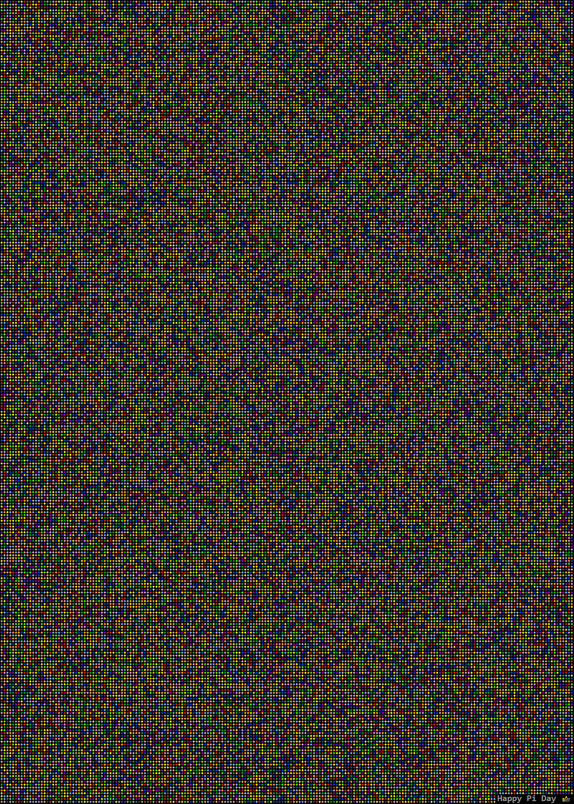

As a programmer you almost have an inherent connection with math. I'm not saying that math is a need for programming, but it sure makes things a whole lot easier!

## Pi day?

In the ISO standard system you write dates in the correct order, from large to small. An example: the fifth of March 2021 is written as: 2021-03-05. So the 14th of March will be written as: 2021-03-14 which is why we call it Pi-day.

As a programmer Pi is almost a magical number. It fascinates me that there is no apparent ending on the number of decimals in it. And when you also have a love for graphics, the combination of the two is easily made. Let me tell you how I made that combination.

## Visualize Pi

So how can you visualize Pi in a cooler way then just a bunch of numbers? We all know Pi is approximately [followed by 100+ digits of pi]

Which is already mesmerizing to look at, but it could be visualized even cooler. If you give each digit a distinct color, then you can create a "painting" of the number Pi like the one below (click on it for full size). Every colored dot is a digit of Pi, and there are a lot of them in that painting.

## Calculating Pi

When I was writing a small program to create the Pi-painting I used the internet as a source to get the needed digits of Pi. But as a true professional you should always check your sources. Which made me realize I NEVER calculated Pi by myself! I always trusted my math-professors and my calculator when they told me Pi was 3.1415 etc…

I took on the adventure to calculate Pi myself, just to make sure my calculator is telling the truth! First of all we need the formula for the calculation, for which I used the highly popular "Chudnovsky algorithm". I chose that algorithm, because it is also used by the super computers to calculate the 50,000,000,000,000 number of digits of Pi (the current world record, which took 303 days to calculate!). I don't have the time or computing power to even approach that kind of digits, but the first 100.000 should be enough (calculated on my laptop).

The used algorithm is a series, meaning that the longer you calculate the more decimals you should get. But after implementing the algorithm all I got was: 3.1415926535897417108201077343, which goes wrong after 13 digits already. 13 digits may sound as a nice precision but I want 100.000 digits of precision!

### So I needed to analyze the algorithm…

Without getting too much into the nitty gritty math stuff there are four numbers used in the series and in math we give numbers cool names when we talk about them. So let me introduce you to C, Mk, Lk and Xk. C is a constant, which is nice and easy. Mk is large number which keeps getting larger and larger when we increase the precision. This also counts for Lk. But the fun starts with Xk, because that number becomes incredibly small and approaches 0 really fast. And that is where my implementation broke, because I used only a decimal type in the calculation. So I ran into the imperfections of that primitive type really fast.

And that turned my 30 minute playtime implementation into a much larger undertaking, because I needed to solve that imperfection problem. Maybe you think "well just leave it there, 13 digits is already quite nice". But we are programmers aren't we!? "Cannot" doesn't exist in our world!

Maybe you guys know I'm also a lecturer at one of the best Universities in the Netherlands. And I'm fortunate enough that I can use some of my boss's time as "professional/personal development". And math is a must for lecturers, right!? So I can use some of that time to research into a better implementation of my pi-calculations.

Fortunately the .NET framework has a BigInteger implementation which can be used to store arbitrarily large integers. Which we can also use to store infinitely small numbers. And that was exactly what I needed to solve my precision problem.

## Conclusion

I'm happy to inform you that I've checked the popular representation of Pi and the first 100,000 digits are indeed correct!

This is an example of a small pet-project which you can do in your own down-time. What is important to "Question everything" and just keep programming as much as possible. Always try to find cool new projects to create and extent your love for programming!

If you also love Pi or just want to chat with us, please leave a comment!
