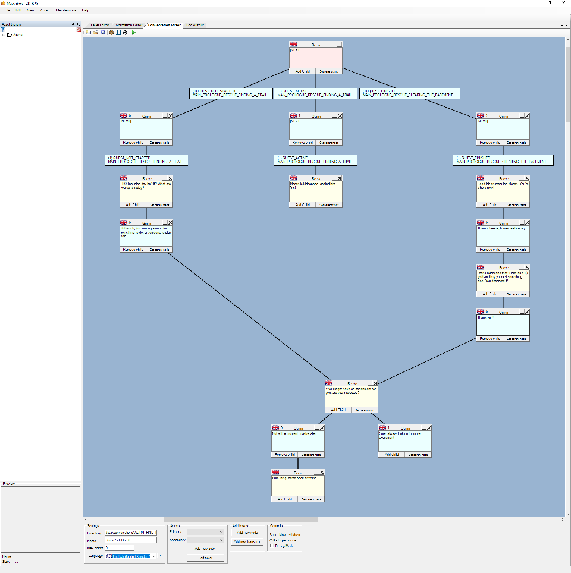
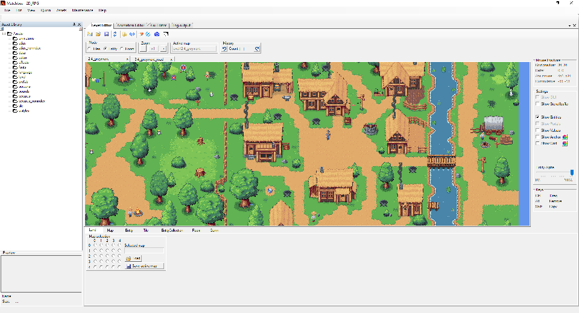

# The Temptation of Building the Perfect Editor

Game development combines creativity, problem-solving, and engineering. Developers frequently encounter repetitive tasks that tempt them to build specialized tools. However, this allure carries a significant risk: excessive time spent on tool development at the expense of actual game creation.

## The Seductive Nature of Tool Building

The impulse to create editors feels practical and logical. Tool-building offers clean, satisfying work with immediate gratification. Yet developers must constantly ask themselves: **when is an editor "good enough"?**

The author notes that building quality tools requires substantial investment in UI/UX, testing, documentation, and maintenance. What begins as a day-long task frequently expands into weeks of refinement, transforming a development aid into a competing project.

## Strategic Tool Investment

Tools prove worthwhile when addressing:

- **Frequently repeated tasks**
- **Error-prone processes**
- **Time-sensitive iteration needs**
- **Multi-team collaboration scenarios**

The critical principle remains **balance**. Tools should serve game development, not become the primary focus.

## Core Philosophy

The fundamental reminder: **developers are creating games, not game engines.**

Players experience stories, atmospheres, and characters—not the underlying infrastructure. Occasionally, manual repetition proves faster than perfectionist automation.

## Key Takeaways

- Build tools when they solve real, recurring problems
- Know when to stop iterating and start using
- Remember the goal: shipping a great game, not perfect tools
- Sometimes "good enough" is genuinely perfect

The best tool is the one that gets out of your way and lets you make your game.
