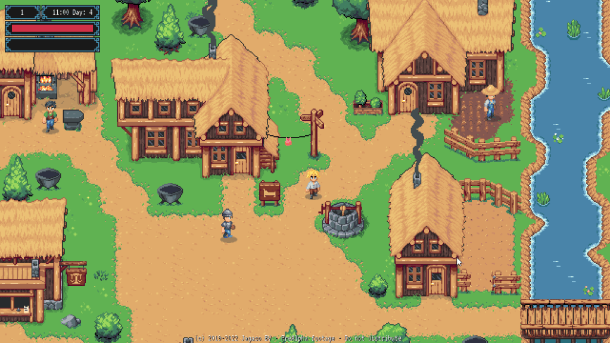
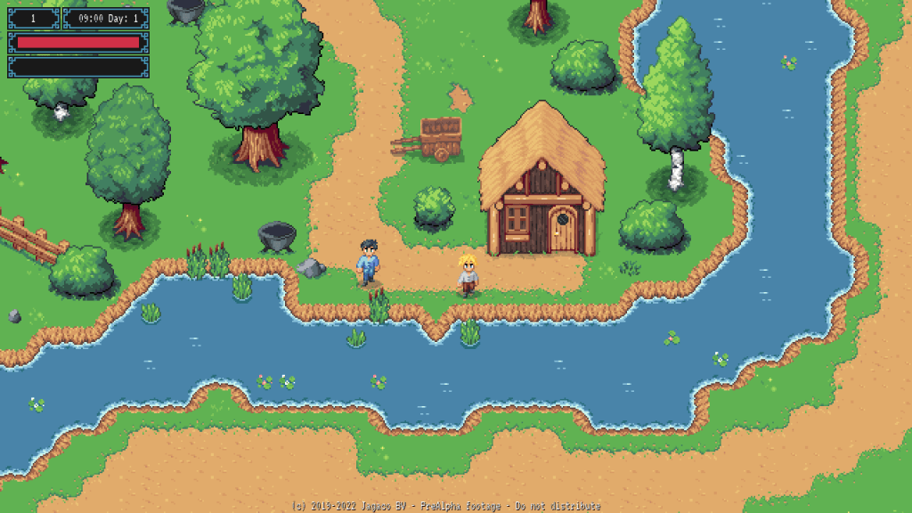
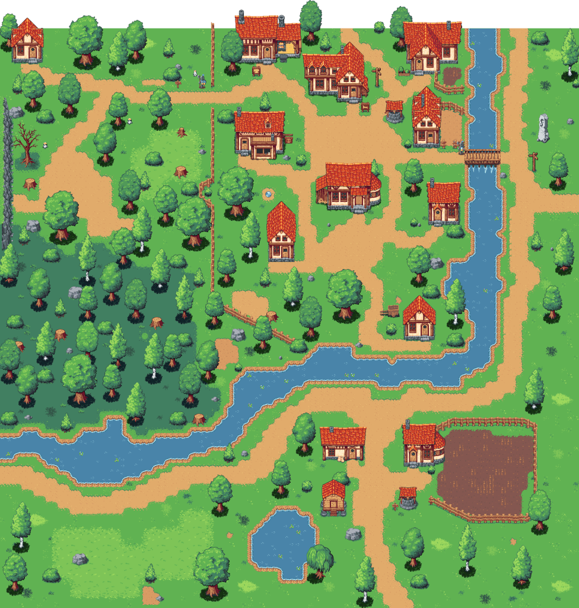

# Town Update

The development team shares progress on their open-world RPG project. The game draws inspiration from classic Gameboy Zelda titles, emphasizing "puzzles, combat with loads of different enemy types" alongside a strong narrative component featuring gathering and crafting mechanics.

## The Protagonist's Home

Players assume the role of a young protagonist who begins in his hometown before encountering larger adventures. The team is currently enhancing the town's atmosphere by introducing:

- NPCs with daily schedules
- Environmental details like vegetation and wildlife
- Side-quest content

## Design Iterations

The developers noted they've iterated on the town design multiple times. Earlier iterations featured overly ornate structures unsuitable for their "medieval farmers village" aesthetic, prompting them to relocate those buildings to a more affluent area.

## Creating Atmosphere

A town isn't just buildings—it's the people who live there, the animals that wander the streets, the gardens that grow, and the stories that unfold. We're focusing on making this starting location feel alive and memorable.

## What's Next?

As we continue development, we're:
- Adding more NPCs with unique personalities
- Creating side quests that reveal the town's history
- Populating the environment with atmospheric details
- Ensuring players feel emotionally connected to this place before they leave

The hometown is more than just a tutorial area—it's a place players will want to return to.
